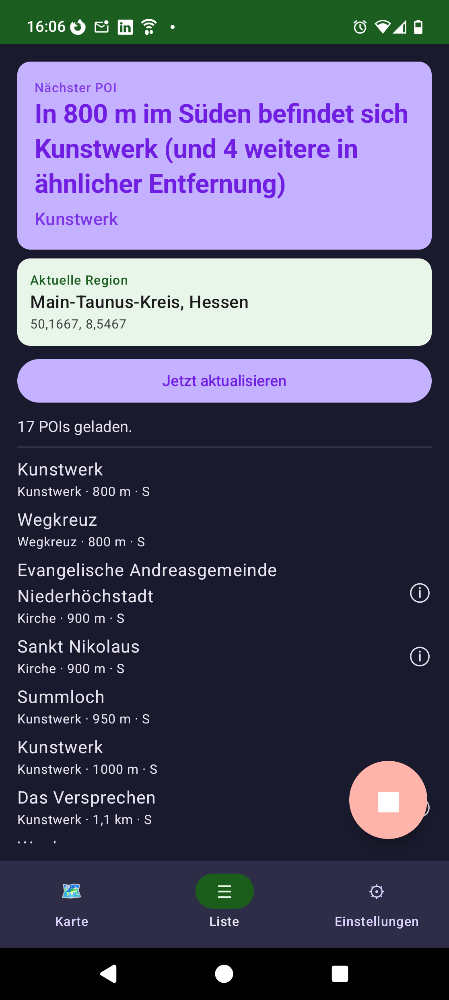
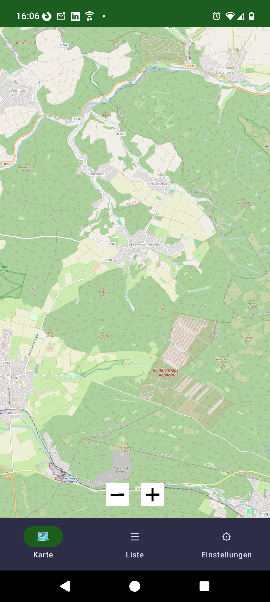

# POIMelder

Android-App für Radfahrer und Autofahrer. Verfolgt im Hintergrund den Standort per GPS und meldet per Notification und Sprachansage (TTS), sobald ein Point of Interest einer gewählten Kategorie in den konfigurierbaren Umkreis kommt.

## Download

📥 Die aktuelle APK findest du unter [Releases](../../releases).

## Screenshots

| | |
|---|---|
|  |  |

## Features

- POI-Daten via OpenStreetMap Overpass-API
- Foreground-Service für Hintergrund-Tracking
- Konfigurierbare Kategorien (Tankstelle, Restaurant, Supermarkt etc.) + eigene OSM-Tags
- TTS-Sprachansage bei Annäherung
- Kartenansicht (osmdroid/OpenStreetMap)
- Enter/Exit-Logik pro POI
- Display-Always-On (getrennt für Kabel/Akku einstellbar)

## Datenaustausch

Diese App nutzt aktuell keinen Cloud-Sync. Sie ist Teil einer App-Familie, deren andere Mitglieder Nextcloud (WebDAV) für den Datenaustausch nutzen. Zukünftig könnten auch andere Services wie Syncthing oder generisches WebDAV zum Einsatz kommen.

## Tech-Stack

- Kotlin
- Jetpack Compose
- Material3
- osmdroid
- Android LocationManager
- Overpass-API
- OkHttp

## Entwicklung

Diese App wurde größtenteils mit einem KI Coding-Agenten entwickelt.

Wenn du dich nicht mit Android-App-Entwicklung auskennst, ist ein Coding-Agent wie
[Kiro](https://kiro.dev) (freies Kontingent verfügbar) oder [OpenCode](https://opencode.ai)
vermutlich die einfachste Art, die App weiterzuentwickeln oder zu bauen.

**Beispiel-Prompt:**

> Schau dir mal dieses Android-App-Projekt an und schaffe die Voraussetzungen für den
> Bau einer APK-Datei (Android App). Baue mir anschließend die APK-Datei.

Wenn du – genau wie ich – gerne mit europäischen Services arbeitest, lohnt sich ein
Blick auf [OpenCode](https://opencode.ai) und den französischen LLM-Provider
[Eden AI](https://www.edenai.co).

### Build

```bash
./gradlew assembleDebug
```

## Unterstützung

☕ [Buy Me a Coffee](https://buymeacoffee.com/asparagus11)

## Lizenz

MIT License – siehe [LICENSE](LICENSE)

## Kontakt

Wenn du die App weiterentwickeln oder forken möchtest, freue ich mich über eine kurze Info an thomas.ad.meyer@gmail.com
